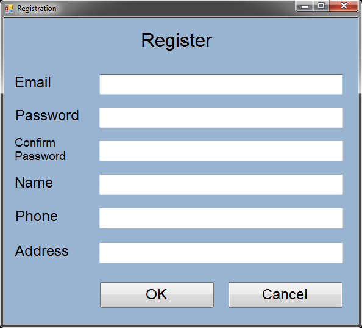
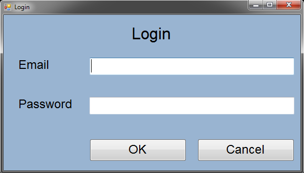

# Login & Registration System with database

Simple Windows Forms application. It uses database with users' data and checks validity of inputted data. It allows registration and logging in.  

### Welcome Form
  

### Registration Form
  

### Login Form
  
